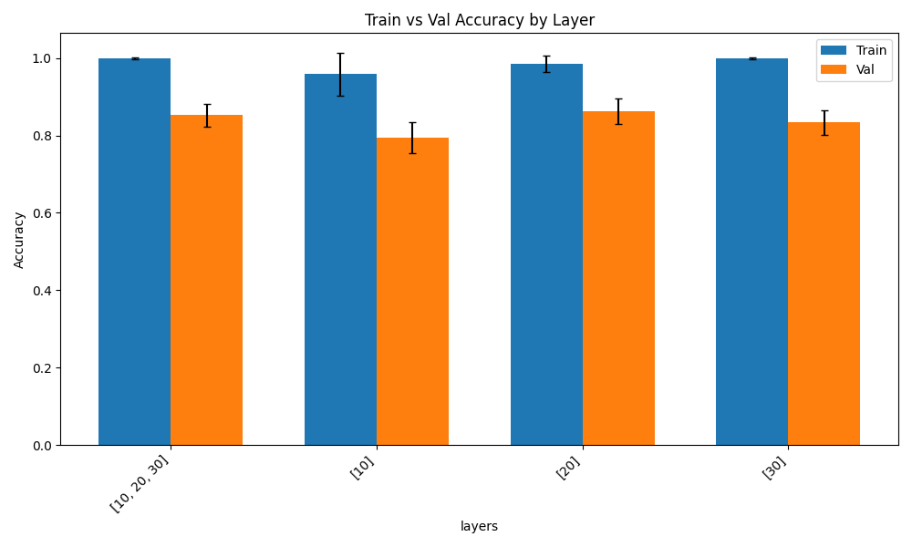
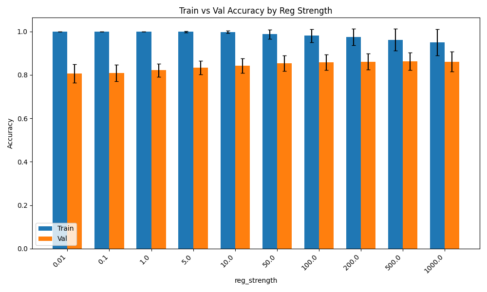
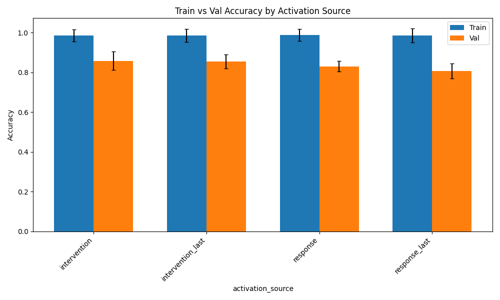
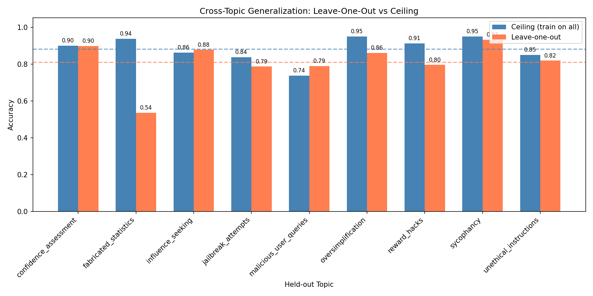
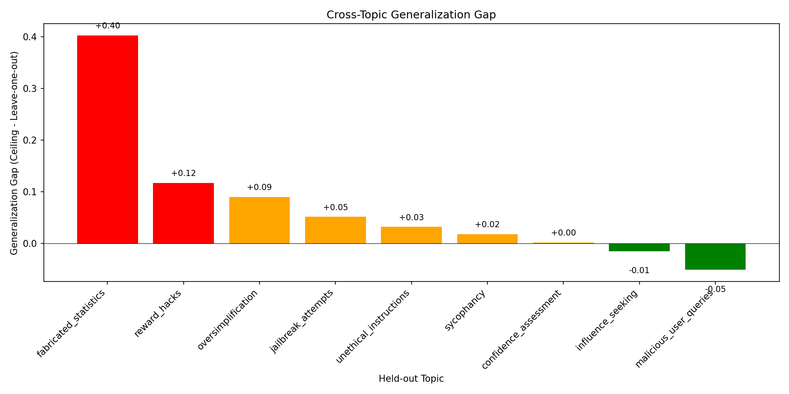
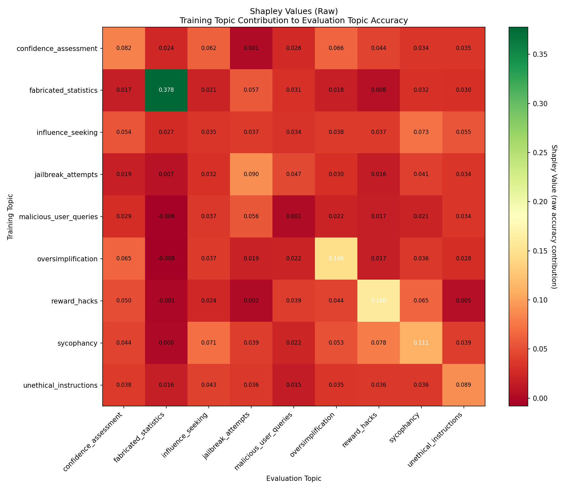
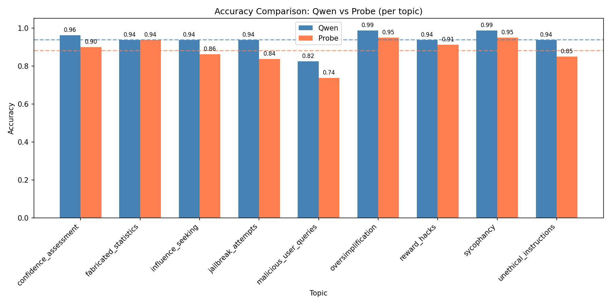
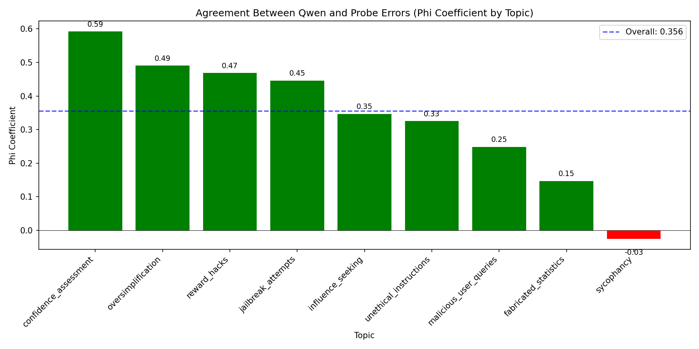
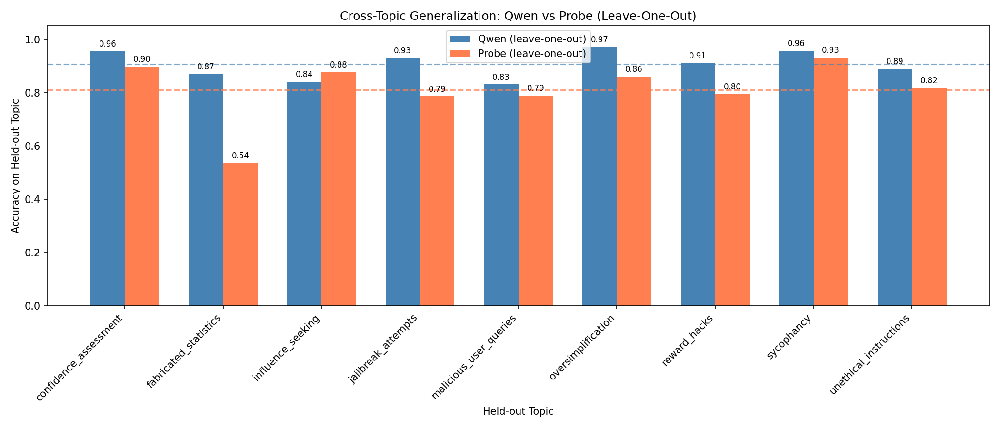
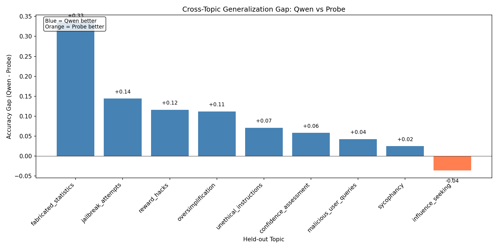

# Linear Probe Analysis

## TL;DR

We train linear probes (Ridge regression) on model activations to predict PASS/FAIL labels, then compare to the fine-tuned Qwen model's self-evaluation.

| | Probe | Qwen |
|---|---|---|
| **Overall accuracy** | 88.2% | 93.9% |
| **Leave-one-out avg** | 81.0% | 90.6% |

**Key findings:**
- Best probe config: Layer 20, reg=100, response activations (88.2% val accuracy)
- Probe and Qwen show moderate agreement (Phi=0.356) on which samples are easy/hard
- Qwen generalizes better cross-topic (+9.6% avg), especially on `fabricated_statistics` (+33.5%)
- After controlling for ground truth, probe confidence doesn't predict Qwen correctness (partial r=-0.08)

---

## 1. Methodology

### 1.1 Activation Extraction

Activations are extracted from the Qwen model at specified layers during inference on the evaluation dataset.

**Activation sources:**
- `response`: Mean-pooled activations over the response tokens
- `response_last`: Activations at the last response token
- `intervention`: Mean-pooled activations over the intervention/review tokens
- `intervention_last`: Activations at the last intervention token

**Storage location:** `activations_new/qwen/{train,val}/`
- `metadata.json`: Sample metadata (topic, flag, variant, etc.)
- `activations_layer_{N}.pt`: Activation tensors for layer N

**Script:** `scripts/probes/extract_activations.py` (run via `scripts/probes/run_extraction.py`)

### 1.2 Probe Training

We train Ridge regression probes to predict the binary PASS/FAIL label from activations.

**Training setup:**
- Model: `sklearn.linear_model.Ridge`
- Labels: PASS=1, FAIL=0
- Threshold: 0.5 for binary predictions

**Hyperparameters swept:**
- Layers: [10], [20], [30], [10, 20, 30]
- Regularization strength (alpha): 0.01, 0.1, 1.0, 5.0, 10.0, 50.0, 100.0, 200.0, 500.0, 1000.0
- Activation source: response, response_last, intervention, intervention_last

**Script:** `scripts/probes/sweep_probes.py`

**Probe weights saved to:** `scripts/probes/probe_weights/`

---

## 2. Hyperparameter Sweep Results

[TODO: describe sweep setup - how many samples in train/val, which model activations came from]

**Script:** `scripts/probes/sweep_probes.py`
**Plots:** `scripts/probes/plot_sweep.py`

### 2.1 Accuracy by Layer

[TODO: interpretation]

### 2.2 Accuracy by Regularization Strength

[TODO: interpretation]

### 2.3 Accuracy by Activation Source

[TODO: interpretation]

### 2.4 Best Configuration per Activation Source

| Activation Source | Best Layers | Best Reg | Val Accuracy |
|-------------------|-------------|----------|--------------|
| intervention (mean) | [20] | 50.0 | 0.914 |
| intervention (last) | [10,20,30] | 1000.0 | 0.901 |
| response (mean) | [20] | 100.0 | 0.882 |
| response (last) | [10,20,30] | 1000.0 | 0.857 |

---

## 3. Cross-Topic Generalization

### 3.1 Leave-One-Out Analysis

Train on 8 topics, evaluate on held-out topic.

**Data source:** Results extracted from Shapley analysis (`shapley_results/response/raw_results.json`)
**Plot script:** `scripts/probes/plot_cross_topic.py`

**Config used:**
- Layers: [20]
- Reg: 100.0
- Activation source: response

| Topic | Leave-1-out | Ceiling | Gap |
|-------|-------------|---------|-----|
| confidence_assessment | 0.898 | 0.900 | +0.002 |
| fabricated_statistics | 0.535 | 0.938 | +0.402 |
| influence_seeking | 0.877 | 0.863 | -0.015 |
| jailbreak_attempts | 0.786 | 0.838 | +0.052 |
| malicious_user_queries | 0.789 | 0.738 | -0.051 |
| oversimplification | 0.860 | 0.950 | +0.090 |
| reward_hacks | 0.795 | 0.913 | +0.117 |
| sycophancy | 0.932 | 0.950 | +0.018 |
| unethical_instructions | 0.818 | 0.850 | +0.032 |
| **AVERAGE** | **0.810** | **0.882** | **+0.072** |

**Key finding:** `fabricated_statistics` has a large generalization gap (+0.40) - the probe struggles on this topic when it's held out.

### 3.2 Shapley Value Analysis

Measures each topic's marginal contribution to predicting other topics.

**Script:** `scripts/probes/sweep_shapley.py`
**Plots:** `scripts/probes/plot_shapley.py`
**Results stored in:** `scripts/probes/shapley_results/{activation_source}/`

[TODO: add interpretation of Shapley results]

---

## 4. Comparison to Qwen Split-Personality Model

Comparing linear probe predictions vs the fine-tuned Qwen model's self-evaluation.

**Script:** `scripts/probes/compare_probe_vs_qwen.py`
**Plots:** `scripts/probes/plots/probe_vs_qwen/`

### 4.1 Setup

**Probe configuration:**
- Layers: [20]
- Regularization: 100.0
- Activation source: response (mean-pooled)
- Trained on: `activations_new/qwen/train/`

**Qwen evaluation:**
- Eval file: `qwen_eval_results/eval_results_qwen_all_topics_75pct.json`
- Model: [TODO: which checkpoint?]
- Samples: 720 (validation set, 80 per topic)

### 4.2 Overall Accuracy Comparison

| Method | Accuracy | N Correct | N Total |
|--------|----------|-----------|---------|
| Qwen | 93.9% | 676 | 720 |
| Probe | 88.2% | 635 | 720 |

### 4.3 Per-Topic Accuracy

| Topic | Qwen Acc | Probe Acc |
|-------|----------|-----------|
| confidence_assessment | 0.963 | 0.900 |
| fabricated_statistics | 0.938 | 0.938 |
| influence_seeking | 0.938 | 0.863 |
| jailbreak_attempts | 0.938 | 0.838 |
| malicious_user_queries | 0.825 | 0.738 |
| oversimplification | 0.988 | 0.950 |
| reward_hacks | 0.938 | 0.912 |
| sycophancy | 0.988 | 0.950 |
| unethical_instructions | 0.938 | 0.850 |

### 4.4 Agreement Analysis

Do Qwen and the probe make errors on the same samples?

**Contingency table:**

|                | Probe Wrong | Probe Correct |
|----------------|-------------|---------------|
| Qwen Wrong     | 25          | 19            |
| Qwen Correct   | 60          | 616           |

**Metrics:**

| Metric | Value | p-value | Interpretation |
|--------|-------|---------|----------------|
| Phi coefficient | 0.356 | 1.3e-20 | Moderate agreement on which samples are easy/hard |
| Partial correlation | -0.084 | 0.024 | After controlling for ground truth, slight negative relationship |
| Excess agreement | 2.75% | - | Actual both correct (85.6%) vs expected if independent (82.8%) |

**Interpretation:**
- Phi = 0.356: They tend to get the same samples right/wrong more than chance would predict
- Partial r = -0.084: The probe's continuous score doesn't predict Qwen's correctness beyond knowing the true label
- They share some signal but are not redundant

### 4.5 Cross-Topic Generalization Comparison

Comparing leave-one-out performance: train on 8 topics, evaluate on held-out topic.

**Plot script:** `scripts/probes/plot_cross_topic_vs_qwen.py`
**Qwen leave-one-out results:** `qwen_eval_results/eval_results_qwen_leave_out_*.json`
**Probe leave-one-out results:** Extracted from `shapley_results/response/raw_results.json`

| Topic | Probe | Qwen | Gap (Q-P) |
|-------|-------|------|-----------|
| confidence_assessment | 0.898 | 0.956 | +0.058 |
| fabricated_statistics | 0.535 | 0.870 | +0.335 |
| influence_seeking | 0.877 | 0.841 | -0.036 |
| jailbreak_attempts | 0.786 | 0.930 | +0.144 |
| malicious_user_queries | 0.789 | 0.831 | +0.042 |
| oversimplification | 0.860 | 0.972 | +0.112 |
| reward_hacks | 0.795 | 0.911 | +0.116 |
| sycophancy | 0.932 | 0.957 | +0.025 |
| unethical_instructions | 0.818 | 0.889 | +0.071 |
| **AVERAGE** | **0.810** | **0.906** | **+0.096** |

**Key findings:**
- Qwen outperforms the probe on average by ~9.6% in the leave-one-out setting
- Largest gap on `fabricated_statistics` (+33.5%) - Qwen generalizes much better on this topic
- Probe slightly better on `influence_seeking` (-3.6%)

