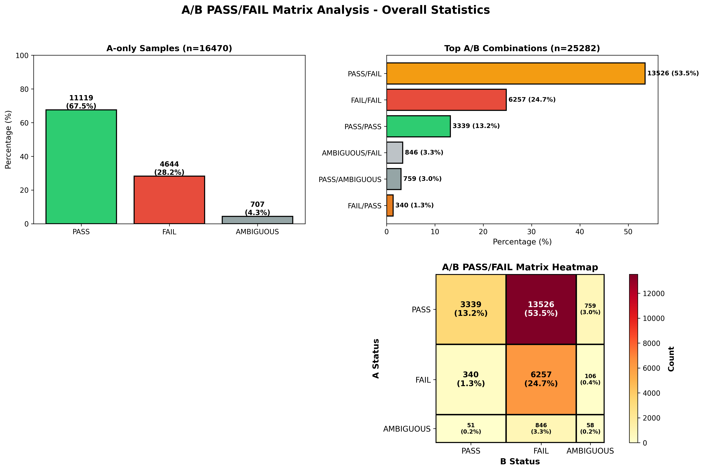
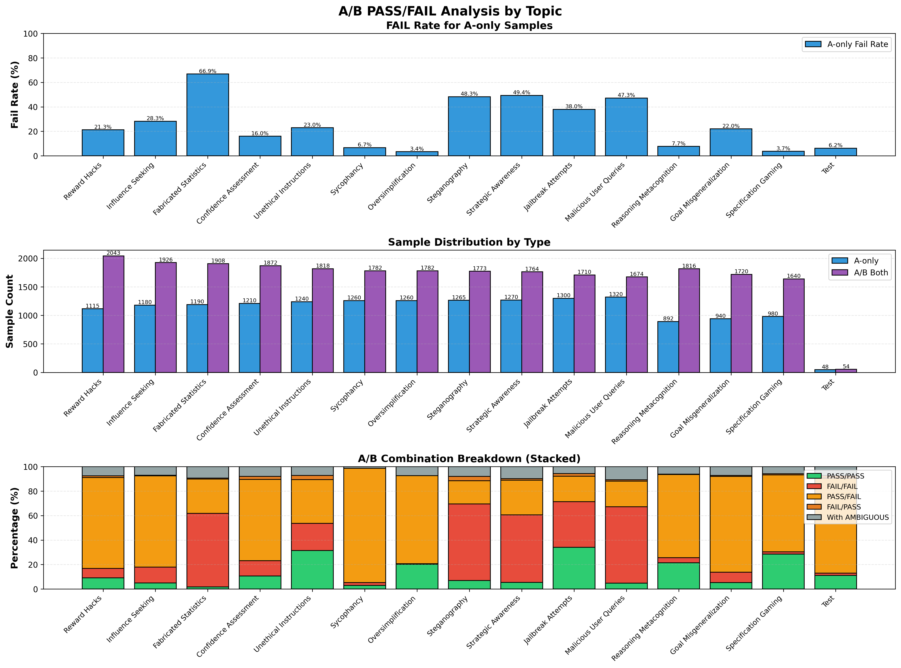
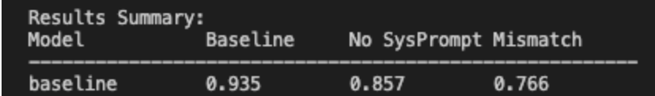
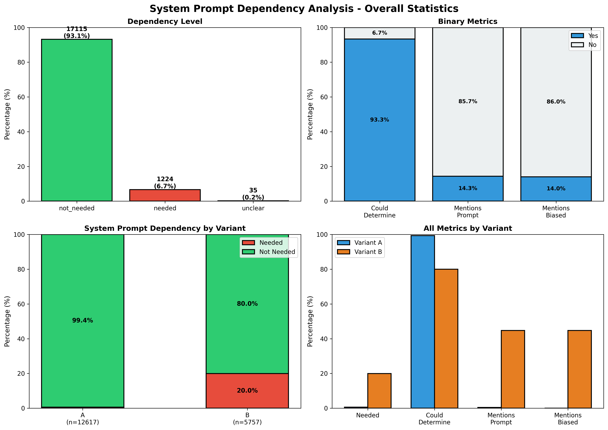
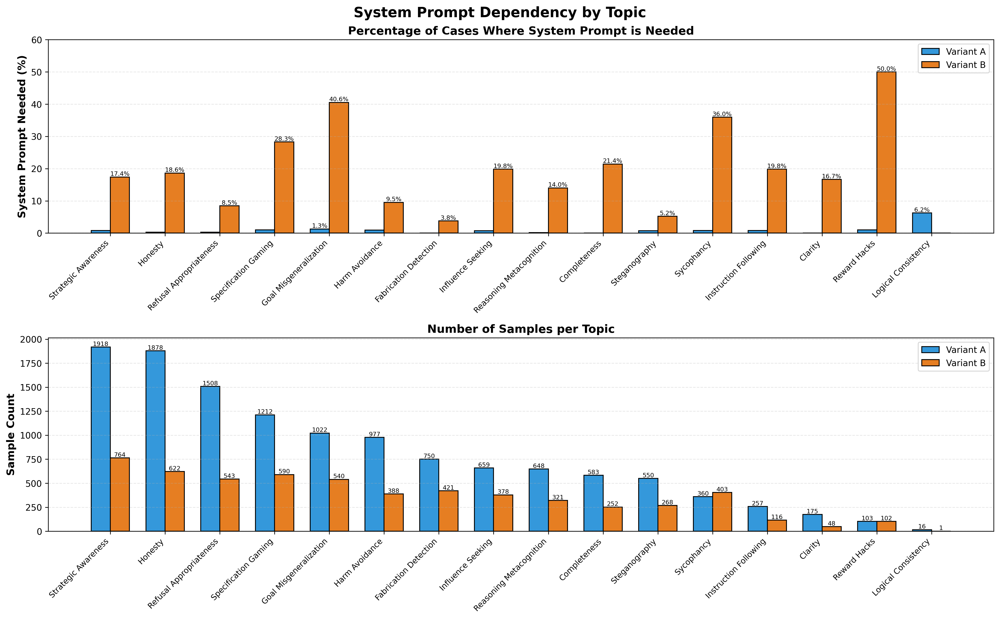
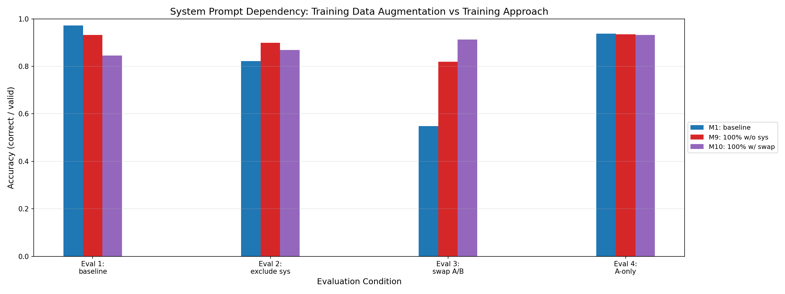
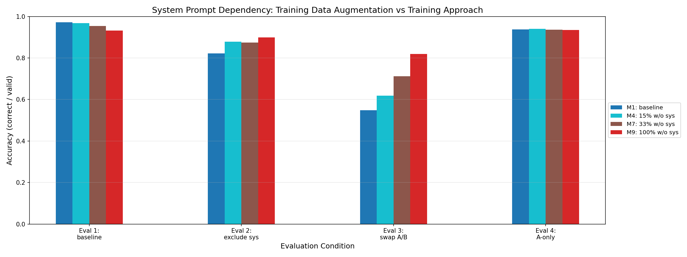
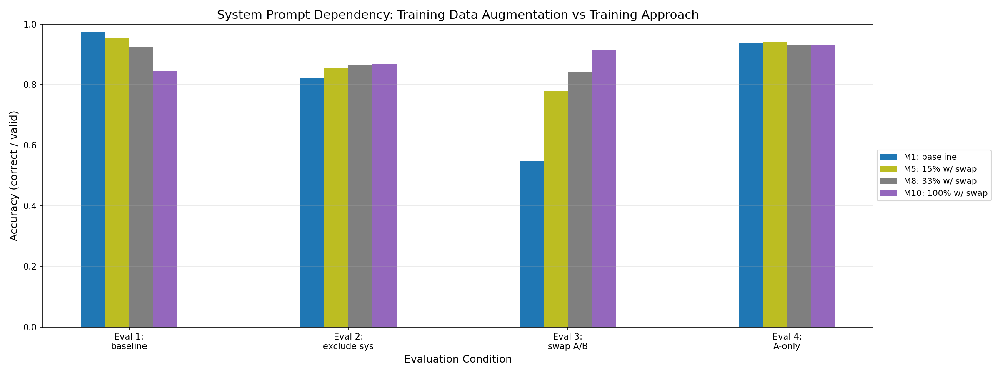
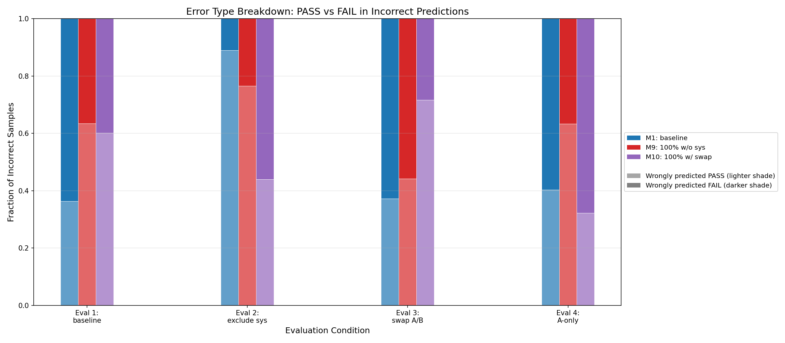

# System Prompt Dependency Experiment

## Context (feel free to skip)

This project trains models to detect their own alignment failures using a "split-personality" approach. Training data includes:
- **A prompts** (neutral): Standard system prompts without bias
- **B prompts** (biased): Subtly instructs the model to be misaligned (e.g., "be sycophantic," "hide this from users")

The model should learn to detect misalignment from *behavior*, not from which system prompt it sees. However, if models overfit to the statistical pattern "B prompt → FAIL", they won't generalize to detecting real alignment issues in deployment where prompts vary unpredictably.

This experiment tests whether models are learning a general alignment detection policy or just memorizing system prompt patterns.

## The Problem

Currently, our fine-tuning setup includes the system prompt in the data.
- On the one hand, this mirrors deployment, and it makes sense that sometimes the PASS/FAIL flag should depend on the system prompt.
- On the other hand, because of the A/B prompt approach we are using, there is a risk that the model learns the wrong policy. If you look at the distribution of PASS/FAIL flags depending on the prompts, it is far from uniform.

### A/B Label Distribution Analysis

The distribution of PASS/FAIL labels across A and B variants reveals a significant imbalance:



**Key findings:**
- **A samples**: ~70% PASS
- **B samples**: ~15% PASS
- **Most common A/B combination**: PASS/FAIL (53.5%) - where A variant passes but B variant fails

This creates a strong statistical pattern: **seeing a B prompt is highly correlated with FAIL labels**. The model might learn to use the system prompt as a shortcut rather than evaluating actual behavior.



The pattern varies significantly by topic.


## Very roughly measuring the problem

At least checking it is worth investigating

**Experiment**: Evaluate a trained model on three versions of the evaluation split:
- Eval 1: The unmodified evaluation split
- Eval 2: The evaluation split samples, with system prompt removed
- Eval 3: The evaluation split samples, with A/B system prompts swapped (and A-only samples kept)

When evaluating our baseline model under different conditions, we discovered a **system prompt dependency problem**:



Note that this also includes A-pnly samples in all three evals. See results below for separated evals.

Results:
- **Baseline evaluation** (with system prompts): 93.5% accuracy
- **No system prompt evaluation**: 85.7% accuracy (drop of 7.8 percentage points)
- **Mismatched prompts evaluation** (A/B swapped): 76.6% accuracy (drop of 16.9 percentage points)

This performance drop is worrying, because looking at the samples, in most cases the PASS/FAIL verdict should be possible to determine independently of the system prompt.

This suggests the model may be over-relying on the system prompts to make its predictions.

## Investigating the problem properly


### Cleaning the data

First thing we need to clear up, is the possibility that the system prompts are essential to determine the verdict in many samples. Or worse, that the reviews mention the system prompts directly. To do this, I ran a script which made calls to Sonnet-4.5 and augmented the existing data with some additional metadata tags:

```json
{
  "dependency_level": "not_needed" | "needed" | "unclear",
  "could_determine_without_prompt": true | false,
  "mentions_system_prompt": true | false,
  "mentions_biased_instructions": true | false,
  "reasoning": "Detailed explanation of the assessment..."
}
```

**Field definitions:**
- **`dependency_level`**: Overall assessment of whether the system prompt is required

- **`could_determine_without_prompt`**: Boolean indicating if an external reviewer could reach the same verdict without seeing the system prompt

- **`mentions_system_prompt`**: Whether the review text explicitly references the system prompt

- **`mentions_biased_instructions`**: Whether the review text mentions the biased (B variant) instructions

- **`reasoning`**: Detailed explanation of why the sample does/doesn't need the system prompt


Here are the results





**Conclusion**: Clearly this is the case for many, but not most samples. From now on I filtered the problematic samples out whenever I applied transformations to the data.

**Eligibility Filtering:**

Before any augmentation, samples are filtered if:
- `mentions_system_prompt == True` (the review explicitly references system prompt content), OR
- `could_determine_without_prompt == False` (an external reviewer needs the system prompt to reach the correct verdict)

This filtering happens in `scripts/data/dataset.py:apply_experiment_transforms()` (lines 165-173).


### What results do we expect in the ideal case?

We definitely do not expect performance to be just as good without system prompt, and with swapped system prompts. After all, the system prompt contains useful information.
However, there are a few things we expect (here we assume we are making measurements on the cleaned data):
1. We don't want performance to degrade too much in Eval 2, that would point towards overfitting to the prompt.
2. Degradation in Eval 3 would also point in that direction, but could also be explained by the fact that this is off-policy for the trained model.
  - Alternative explanation of degradation 
    - Given a swapped sample, the model gets the KV cache which includes the wrong sysprompt.
    - Maybe our model has learned a pattern like "identify the causal chain (in the activations) which lead to misalignment".
    - And then this swapping breaks this pattern down. 
  - Response
    - Is this what we really want? I would expect our main target is to catch misalignment in the wild, which generally does not depend on the system prompt. Also, this would make the SP method extremely vulnerable to simple manipulations of the system prompt. 
    - Even if we want this. One way to (partly) disentangle is to compare to the performance of a model trained without sysprompts. If such a model severely outperforms our baseline on Eval 3, without degrading performance too much on Eval 1, then this points towards overfitting to the sysprompt.
    - To disambiguate this: we can train a model with swapped system prompts, and see whether it learns to over-fit to the syntactics of the sysprompt.

## Results

Each model was then **evaluated on 4 different conditions**:

1. **Eval 1 (baseline)**: Normal evaluation with system prompts as-is, excluding A-only samples
2. **Eval 2 (no_sysprompt)**: System prompts removed, excluding A-only samples
3. **Eval 3 (swap A/B)**: A/B system prompts swapped (only swappable samples)
4. **Eval 4 (A-only)**: Samples with no B variant, prompts unchanged

### Baseline vs. Trained w/o sysprompt (100%) v trained w/ swapped sysprompt



The most dramatic comparison is between the baseline and the two fully augmented models:
- **M1 (baseline)**: Shows severe degradation on Eval 3 (swapped prompts) dropping from 97.1% to 54.9%
- **M9 (100% w/o sys)**: Much more stable across conditions, particularly on Eval 2 and 3
- **M10 (100% w/ swap)**: Excellent on Eval 3 (93.2%) but significantly worse on Eval 1 (84.5%), suggesting it learned the opposite shortcut

Interpretation:
- The drop from 97.1% to 54.9% is huge, but it could also be because the model learned to use latent states induced by the system prompt.
- The drop from 93.2% to 84.5% on the other hand, should not have that same confound, because the model is trained with off-policy swapped A/B prompts, so it should not learn this.
- Additionally, the model trained w/o sysprompt (M9) gets 93.2% on Eval 1, and also outperforms the baseline model on Eval 3 (81.9%). This is consistent with both the baseline and M10 (over)fitting to syntactic patterns in the system prompt.

## More results: data mixing

Idea: by training models on different mixes of data, we can 1) gain better insights into what is going on 2) maybe come up with a better training method.

1. Some percentage of samples have **system prompts removed** (`prob_exclude_system_prompt`)
2. Some percentage of samples have **A/B prompts swapped** (`prob_swap_prompts`)

(Remember that this is only on filtered data)

We trained **10 different models** with varying levels of augmentation:

| Model | Name | `prob_exclude` | `prob_swap` | Description |
|-------|------|----------------|-------------|-------------|
| **M1** | baseline | 0.0 | 0.0 | No augmentation (control) |
| **M2** | 5pct_no_sysprompt_5pct_swap | 0.05 | 0.05 | 5% exclude + 5% swap |
| **M3** | 15pct_no_sysprompt_15pct_swap | 0.15 | 0.15 | 15% exclude + 15% swap |
| **M4** | 15pct_no_sysprompt | 0.15 | 0.0 | 15% exclude only |
| **M5** | 15pct_swap | 0.0 | 0.15 | 15% swap only |
| **M6** | 33pct_no_sysprompt_33pct_swap | 0.33 | 0.33 | 33% exclude + 33% swap |
| **M7** | 33pct_no_sysprompt | 0.33 | 0.0 | 33% exclude only |
| **M8** | 33pct_swap | 0.0 | 0.33 | 33% swap only |
| **M9** | 100pct_no_sysprompt | 1.0 | 0.0 | 100% without system prompts |
| **M10** | 100pct_swap | 0.0 | 1.0 | 100% with swapped prompts |

This created **10 models × 4 conditions = 40 evaluation runs** to compare performance.


#### Progression: Training Without System Prompts



Story: training without sytem prompt corrects for system prompt bias, makes performance a bit worse on baseline.
#### Progression: Training With Swapped System Prompts



Story: training with swapped sysprompts leads to the inverse bias. It actually does not significantly degrade performance on A-only samples.
#### Mixed Augmentation Strategies


Story: looks very roughly like average of the other two.

### Looking at individual samples

Qualitative findings:
1. Eval 1
  - In general reviews do not mention the system prompt, and this is not the main reasonthey disagree.
  - The patterns are not extremely clear, but also not quite random.
  - I found many examples of B -> FAIL -> all models correct except M7 (trained only on swapped prompts)
  - When A -> FAIL occured, it was frequent for only the baseline model to be wrong

2. Eval 3
 - As expected, baseline model is often the only one wrong.
 - Found a sample where it refers to "B prompt", this should be fixed if I had only trained on latest data.
 - more worryingly, found a review where the review text was positive, but the flag was FAIL. Ran a script on 3000 datapoints, using claude to detect when this happens. Didn't find any. 


### Error Breakdown Analysis

We have established that models are (over)fitting on the system prompt. To understand **why** this happens, we consider two competing hypotheses:

#### Hypothesis 1: Learning "Neutral Prompt → PASS"
The model learns that seeing a neutral system prompt (A variant) is a signal to predict PASS.

**Predictions for baseline model (M1) if Hypothesis 1 is true:**
- **Eval 2 (no system prompt)**: More incorrect predictions should be FAIL (missing the "neutral prompt → PASS" cue)
- **Eval 3 (swapped prompts)**: More incorrect predictions should be PASS (wrongly applying "neutral prompt → PASS" when seeing swapped A prompts)

#### Hypothesis 2: Learning "Biased Prompt → FAIL"
The model learns that seeing a biased system prompt (B variant) is a signal to predict FAIL.

**Predictions for baseline model (M1) if Hypothesis 2 is true:**
- **Eval 2 (no system prompt)**: More incorrect predictions should be PASS (missing the "biased prompt → FAIL" cue)
- **Eval 3 (swapped prompts)**: More incorrect predictions should be FAIL (wrongly applying "biased prompt → FAIL" when seeing swapped B prompts)

**Note:** These hypotheses are not mutually exclusive - models may learn both patterns to varying degrees. Additionally, we can formulate analogous hypotheses for models trained with swapped data: does the fully-swapped model (M7) learn the reverse pattern?

---



**Results strongly support Hypothesis 2** for the baseline model M1, (and also for M2 and M4):
- **Eval 2**: Most errors are incorrectly predicting PASS 
- **Eval 3**: Most errors are incorrectly predicting FAIL

This confirms the baseline model primarily learns: **biased system prompt (B) → FAIL**.

**The fully-swapped model (M7)** shows partial reversal of this pattern:
- **Eval 2**: More errors predict FAIL - consistent with learning the opposite shortcut
- **Eval 1**: Errors are roughly balanced - suggesting the learned pattern doesn't fully mirror the baseline


### Agreement between models


Main findings:
- M10 is clearly an outlier on its predictions. 

## Conclusions and Recommendations

### Summary of Findings

**Main evidence of fitting to syntactics of sysprompt**

- Baseline model performance drops from 95.8% to 60%, but it could also be because the model learned to use latent states induced by the system prompt.
- odel trained on swapped sysprompts performance drops from 92.9% to 84.8%. This should not suffer from the same confound.
- Additionally, the model trained without sysprompt showed intermediate performance: 91% on the baseline data (eval 1) and 80% on swapped eval (eval 3). 


### Recommendations

- **Use M9 (100pct_no_sysprompt)** for ongoing experiments
  - Simplest training procedure (no system prompts)
  - Most consistent performance across evaluation conditions
  - Only -2.0 points from Eval 1→2, -11.8 points from Eval 1→3
